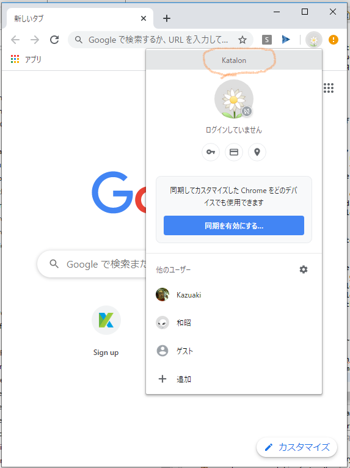

WebDriver Factory for Katalon Studio
========================================================================

I have abandoned this project "WebDriverFactory4ks". The final version was v0.3.5. 
I have started another project "WebDriverSupport4ks" at https://github.com/kazurayam/WebDriverSupport4ks which succeeds the artifact of the "WebDriverFactory4ks" in the new name.

---

- by kazurayam,
- 1st edition published March,2019
- 2nd edition published Jan, 2020
- v0.3.5 Dec 2021

## Problem to solve

A post in the Katalon Forum [Run Automation in the Active browser](https://forum.katalon.com/t/run-automation-in-the-active-browser/19237/4) raised an interesting question. The originator **aguggella** gave us a good explanation what his/here problem is. I would quote the paragraphs with a bit of rewording:

---

>I have Salesforce application which will send OTP (one time password) to the client's browser on the following occasions: (1) first time of logging-in, (2) at the second logging-in and later when the browser does not present credential information associated with the original OTP because the browser's cache is cleared or empty

>I need to open browser manually and login to the Salesforce application once. A new OTP will be issued and processed. I will do that anyway. As long as I use the same Profile of Browser without clearing cached data, the original OTP is retained in the cache. I will not be asked to repeat login operation.

>Problem arises here: I want to automate testing the Salesforce application using Katalon Studio, but I can not. Why? Whenever I start test script, Katalon executes opens a new browser with no cached data. Therefore Salesforce application sends a new OTP. New OTP requires my manual intervention. Automation broken.

---

Let me assume, I opened Chrome with a Profile 'Katalon' and logged-in Salesforce applition.
If I could somehow let Katalon Studio to start Chrome with the same Profile 'Katalon',
then the test will run without requiring manual intervention.
But how can I achieve it?


## Problem analysis

### How to open Chrome with predefined profile


**Thanh To**, a Katalon Developer, replied to **aguggella** in another post [Open Browser with Custom Profile](https://forum.katalon.com/t/open-browser-with-custom-profile/19268). He described the following points:
1. In Chrome UI, you can create a new Profile with name `new_chrome_profile`
2. In Chrome UI, you can identify the Profile path, a folder, where all of cached data is stored. For example, the Profile `new_chrome_profile` is found associated with the  `C:\users\osusername\AppData\Local\Google\Chrome\User Data\Profile 2` folder. The association of `new_chrome_profile` and `Profile 2` was determined by Chrome when `new_chrome_profile` was added.
3. In Katalon Studio, in test case script, you can write Groovy code to open Chrome browser as this:
```
ChromeOptions chromeProfile = new ChromeOptions();
chromeProfile.addArguments("user-data-dir=" + "C:\\Users\\thanhto\\AppData\\Local\\Google\\Chrome\\User Data\\");
chromeProfile.addArguments("profile-directory=Profile 2");
```

### Terminologies

Let me make the meaning of 2 important terminologies clear.

1. What does `Profile` means in Chrome?
2. What does `profile-directory` or `Profile path` means in Chrome?

You can add `a User` or `a Profile` into Chrome. See https://support.google.com/chrome/answer/2364824?hl=en&co=GENIE.Platform=Desktop how to.
I have a Profile named `Katalon` in my Chrome as follows:



Once I open Chrome with `Katalon` profile, and navigate to `chrome://version` page, then I can see the following:


Here I could find a line:

```
Profile Path: C:\Users\kazurayam\AppData\Local\Google\Chrome\User Data\Profile 2
```

This is the `Profile Path`. And the name of the folder `Profile 2` is the `profile-directory`.

### Core issue

It's great to know that I can write test code that can open Chrome with predefined Profile. But I find a itchy problem still remains.

- I created a new Profile with name `Katalon`.
- Chrome creates a new folder named `Profile 2`.
- Chrome associates the Profile `Katalon` to the profile-directory `Profile 2`.

It's OK for me to write the profile name `Katalon` as a constant string in test cases.

But I do not like to write the folder name `Profile 2` as a constant string in my test case code.

I know I can view and find the folder name by checking the `chrome://version` page. But this manual preparation looks less stylish. I want automate stuff as much as possible.


## Solution proposed

I have developed a custom groovy class `com.kazurayam.webdriverfactory.chrome.ChromeDriverFactory`. This class is capable of launching a ChromeDriver while specifying a User Profile you prepared.

## Demo

### open Chrome with a custom User Profile

The following Test Case shows a simplest usecase. You want to create a Chrome User Profle named `Katalon`. You want to choose Chrome in Katalon Studio GUI as browser to activate. Then a Chrome will open using the `Katalon` profile.

[Test Cases/main/example/how_to_usingWebDriverFactory](Scripts/main/example/usingWebDriverFactory/how_to_newWebDriverWithCustomProfile/Script1582158787629.groovy)

### open Chrome with a custom User Profile and try to navigate to Gmail.

The following Test Case uses a User Profile of my daily use, and tries to nagivate to Gmail.

[Scripts/main/example/usingChromeDriverFactory/how_to_newChromeDriverWithCustomProfile](Scripts/main/example/usingChromeDriverFactory/how_to_newChromeDriverWithCustomProfile/Script1582262429415.groovy)

I hoped that I can open Gmail withtout any login interaction. But in vain. Chrome browser seems recongize that it is controlled by some suspecious automation tool, not by a human, and forces a login interaction. How Chrome is secure!


## How to use WebDriverFactory4ks in your Katalon project

1. Download the `webdriverfactory4ks-x.x.x.jar` from the GitHub project's [Releases](https://github.com/kazurayam/webdriverfactory4ks/releases/) page.
2. Place the jar into the `Drivers` directory of you Katalon Studio project; just as documented in the doc [External libraries](https://docs.katalon.com/katalon-studio/docs/external-libraries.html)
3. Write your test case script which calls the  `com.kazurayam.webdriverfactory4ks.WebDriverFactory` class.


## API doc

The Groovydoc of webdriverfactory4ks is [here](https://kazurayam.github.io/webdriverfactory4ks/api/index.html)

## What I found 

I was not successful for my issue. I have never succeeded to make Chrome Browser started retaining “already logged in status” of Web applications. I could not find out the detail but Chrome Browser is very well-engineered in terms of “Security”. I could not cheat Chrome at all.
See https://forum.katalon.com/t/opening-chrome-browser-with-a-predefined-custom-chrome-profile-which-stores-session-info-such-as-credentials-and-cookies/20966/14


I only targeted Chrome browser. I could not cover FireFox, Edge and other types of browsers. This issue is too difficult for me.
